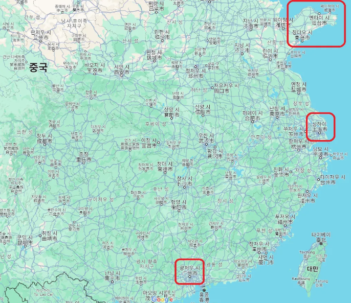

🏠 > [biz_purchasing](../) > [s1_preparation](./) > `배송대행`

### INDEX
- 1. 배대지란? 
- 2. 배대지가 필요한 이유
- 3. 배대지 배송대행 절차 
- 4. 중국 대표 배대지 지역  

---
## 배송대행

### 1. 배대지란? 
 > 배대지란, **배송대행지**의 약자
 
- 상품이나 물품을 판매자로부터 구매자에게 전달하는 과정에서 발생하는 **물류 및 운송 업무를 대신 처리하는 업체**를 말합니다.  
- 배대지는 주로 해외직구를 할때 많이 이용하게 됩니다. 왜 그럴까요? 
  - 해외 제품을 국내에 있는 고객까지 이동하는 것이 상당히 복잡하고 오래 걸립니다. 
  - 그래서, 이 과정만을 집중적으로 관리하는 배대지 업체가 필요한 것입니다. 

 
 
[[TOP]](#index)
 
---
### 2. 배대지가 필요한 이유
 
- 국내에 있는 구매자가 해외직구 또는 구매대행을 한다고 했을때, 
  - 해외에 있는 상품이 국내에 살고있는 고객의 집까지 전달되기까지 거쳐야 할 절차가 많습니다. 
 
- 만약 구매대행으로 상품을 구매했다면, 구매대행 셀러가 해외 쇼핑몰에서 상품을 구매합니다. 
  - 해당 상품은 **해외에서 국내로 배송을 대행해 줄 배대지업체에 입고되고, 검수하고 통관**을 거칩니다. 
  - **통관에서 문제가 없다면 국내 택배사를 통해 고객의 집까지 배송**됩니다. 
 
- 위와 같이 작성했을땐 간단해 보이지만, 
  - 각 절차에서 해야할 일이나 주의사항 등이 많기 때문에 생각보다 어렵고 다양한 문제가 많이 발생합니다. 
  - 이처럼 **배송대행 과정이 복잡**하기 때문에 이 과정을 잘 해결해줄 **배대지 업체가 필요**한 것입니다. 
 
 
 
[[TOP]](#index)
 
---

### 3. 배대지 배송대행 절차 
> 배대지 **배송대행 절차**는 총 5단계가 있습니다. 
 
1️⃣ 해외 쇼핑몰 상품 구매 
- 셀러가 등록한 **국내 마켓(쿠팡, 스마트스토어 등)의 고객으로부터 주문**이 들어오면, 
- 셀러는 **해외 온라인 쇼핑몰(타오바오, 알리익스프레스 등)에서 상품을 구매**합니다. 
 
2️⃣ 배송대행 신청서 작성
- 구매한 상품에 대한 **배송 대행을 요청**하기 위해 [배송대행 신청서]를 작성합니다. 
- **[배송대행 신청서]를 작성**할 때는 
  - 먼저 **받는 사람과 운송 방식에 대한 정보를 입력**해야합니다. 
  - 그리고, **트래킹넘버, 통관 품목, 상품명, 수량 등을 입력**해야합니다. 

3️⃣ 검수 및 포장 진행 
- [배송대행 신청서]를 작성하면 **접수가 신청**됩니다. 
  - 그러면, **배대지에서 상품을 확인한 뒤 셀러에게 검수를 요청**합니다. 
  - 이때, **셀러는 문제가 없는지 검수 확인**합니다. 
  - 그 이후 **배대지에서는 포장**을 진행합니다. 
 
4️⃣ 배송비 결제 및 출고
- **포장이 완료**되면, **셀러는 배송비를 결제**합니다. 
- 그러면, **상품은 배대지에서 출고**됩니다. 
 
5️⃣ 통관 및 국내 배송 
- 상품이 국내 세관에 도착해 **통관 절차를 진행**하고, 
- 문제가 없을 시 국내에서 **고객의 집까지 배송을 진행**합니다. 
- 일반적인 배대지 프로세스는 위와 같습니다. 
  - 배송대행 신청서를 작성시 시간이 너무 오래걸리거나 배대지 CS가 너무 오래 걸리는 경우가 많다. 
  - 그래서, 이러한 문제를 해결하기 위해 [배송대행지 서비스 회사]를 활용한다
  
 
 
[[TOP]](#index)
 
---
### 4. 중국 대표 배대지 지역 
 
- 현재 해외구매대행을 가장 활발하게 하는 국가는 중국입니다. 
  - 따라서, 중국에 배대지 업체가 가장 많고 배대지 서비스가 잘 되어있습니다. 
 
- 중국은 땅이 넓은 만큼, 지역이 다양합니다. 
  - 중국 배대지로 대표적인 곳은 산동반도, 상하이, 광저우가 있습니다. 

<!--  -->

 - 중국 쇼핑몰에서 상품을 구매하여 국내로 배송할 경우 배대지가 가장 많은 곳은 위 3개 지역입니다. 
- 중국 배대지를 이용할 경우, 중국 배대지의 지역별 장점과 단점에 대해 명확히 파악하고 최종 선택하는 것이 좋습니다. 

 
 
[[TOP]](#index)
 
---
