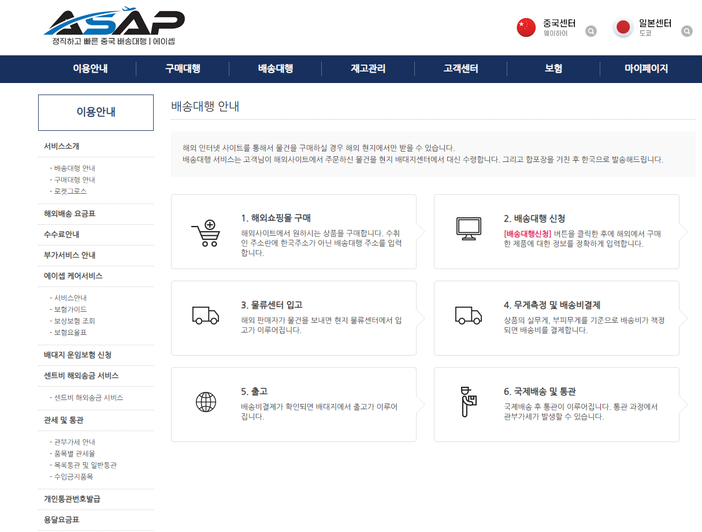
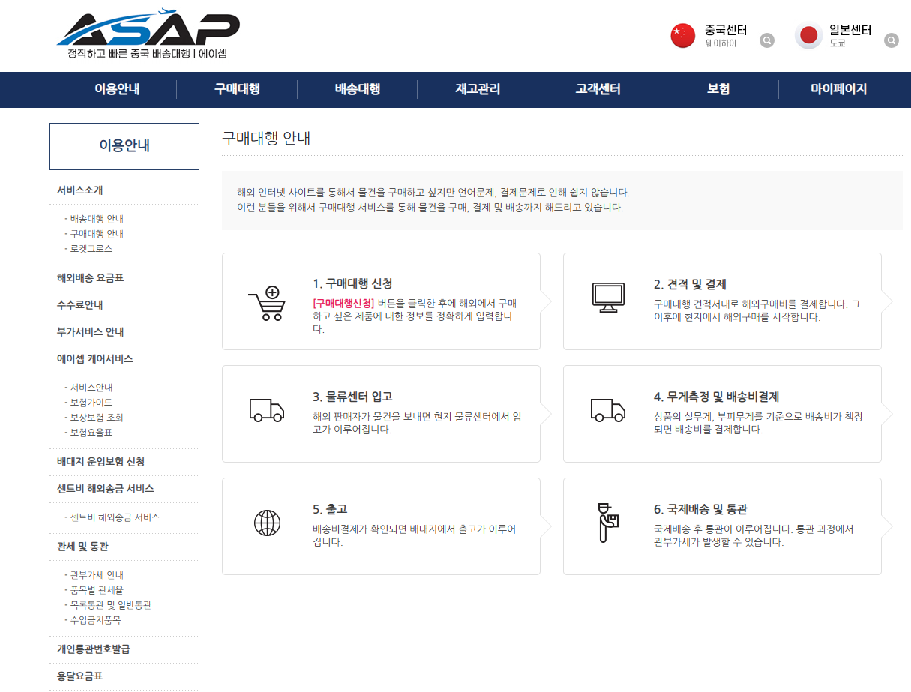

🏠 > [biz_purchasing](../) > [s2_pps_china](./) > `실전_중국상품_구매대행`

### INDEX
- [중국상품 구매대행사업](#중국상품-구매대행사업)
- [[실전] 개략적인 프로세스](#실전-개략적인-프로세스)
- [[실전] 주문처리](#실전-주문처리)
- [[실전] 배송처리](#실전-배송처리)
- [해외구매대행을 위한 유용한 사이트 및 솔루션](#해외구매대행을-위한-유용한-사이트-및-솔루션)

---
## 중국상품 구매대행사업

### 0️⃣ 사전준비
  - 사업자등록: 전자상거래(통신판매업)
  - 유의사항 
    - 지적재산권 조심  
      - [x] 나이키, 키티 등 제품명 안들어가게 하기
      - [x] 유명인 사진 안나오게 하기 
      - [x] KC인증필요제품 취급안하기   
        - eg. 조명(전지) 배터리, 유아용품, 수도용품(수전), 의약품 등

---
## [실전] 개략적인 프로세스
> 하나의 상품을 등록에서 판매 및 배송까지의 실제 절차대로 기술 

### 1️⃣ 상품소싱 
  - 제품선정 : [윈들리]
  - 제품수집 : [타오바오] 
  - 제품판매 : [판매쇼핑몰]에 업로딩

### 2️⃣ 제품주문
  - 주문받은 제품 "이미지 검색"으로 [타오바오]나 [1688]에서 제품 주문
    - [[타오바오]](https://www.taobao.com/) : 중국의 쿠팡같은 온라인쇼핑몰
    - [[1688]](https://www.1688.com/) : 중국의 도매전문 사이트, 가격이 저렴
      - 좋은물건 고르기, 공장찾기, 공업제품
      - [이미지검색] 이 가능

### 3️⃣ 배송처리 
> 중국배송대행서비스 [ASAP] 활용
  - 중국쇼핑몰([타오바오],[1688] 등)에서 구매한 제품 입고처리 후 
  - [ASAP] 에서 입고된 제품을 CJ송장번호 발행하여 한국배송
  - [ASAP] 입고방법 : 
    - 배송대행 ⇒ 엑샐대량등록 ⇒ 엑셀샘플다운로드 ⇒ 장부시트지 내에 배대지 양식 복사 ⇒ 샘플양식에 붙혀넣기 ⇒
      저장후 [ASAP] 파일업로드 ⇒ 입고대기 들어가서 엑셀 다운

### 4️⃣ 주문처리 
  - [ShopMine] 가송장(4로 시작한 10자리 무작위 숫자) CJ송장번호로 수정
  
 
 
[[TOP]](#index)

---
### [실전] 주문처리 
  - 샵마인의 [신규주문] 에서 주문건 확인
    - `수집하기` 클릭하면 자동 리스트업
    - 클릭 후 `주문확인` 클릭하면 [발송대기]로 넘어간다
  - [발송대기]
    - `수집하기` 클릭하면 리스트가 뜬다
    - 전체 클릭후 `엑샐파일생성`클릭하여 엑셀파일 생성
      - 양식명: 하루2시간 구매대행 자동화 양식
    - 엑셀파일을 오픈한 후, 신규등록된 리스트를 모두 복사하여
    - 장부시트파일의 [신규주문]탭에 복사한것을 붙혀넣는다.
    - [고유번호] 컬럼을 선택하여 복사 후 [주문서]탭으로 이동
  - [주문서]
    - [고유번호] 컬럼에 붙혀넣어준다
    - 자동으로 상품 따라온다
    - 그리고, [샵마인]으로 돌아가서 주문한 [상품번호]를 확인한다.
      - [상품번호]를 클릭하면 주문정보가 나온다.
      - 고객이 주문한 정보 및 옵션을 확인 가능
    - 중국사이트에서 제품주문
      - 사이트에서 제품사진을 스크린샷 햐여 [타오바오]에 카메라버튼(이미지검색) 클릭하여 붙혀넣는다.
      - 이미지로 검색하여 실제배송할 최저가상품을 찾는다.
      - 참고로 해외배송이므로, 배송안내에 대핸 내용을 상품등록시 상세페이지에 넣어야 향후 분쟁을 예방할 수 있다.
      - 장바구니에 넣어 두고 나중에 일괄주문 처리하기 위함이다.
        - 200위안 넘어갈 경우, 수수료 발생하므로 분할 결재 해야 함.
      - 위안화로 결재하면 [알리페이]로 결재가 됨.  사전가입 요망!
      - [알리페이]앱에서 QR코드로 스캔하여 결재처리
    - [타오바오]에서 [구매내역] 클릭하여, 
      - [주문번호]를 복사하여 장부시트로 넘어간후, 
      - 장부시트 [주문서]탭에서 [타오바오 주문번호]를 붙혀넣는다.
      - 그리고 구매금액을 [주문금액]에 복사하여 붙혀넣는다. 환률에 따라 주문금액이 자동으로 달라진다.
    - [발송대기]탭에서 탭배사와 송장번호 입력
      - 택배사: CJ대한통운
      - 송자번호: 4로 시작하는 숫자 10자리 무작위로 입력후, 
      - 리스트 [x]에서 체크한 후, [발송처리] 버튼 클릭
    - 주문처리는 모두 완료!!

 
 
[[TOP]](#index)

---
### [실전] 배송처리 
  - [배송중]탭에서 [송장수정모드 켜기]를 클릭
    - 4자 시작상품: 주문처리 상품
    - 3자 시작상품: 입고대기 상품 or 출고 상품, 즉 배송중 상품
  - 입고처리 
    - 중국내 배송중 상품의 [송장번호]를 시트지에 입력
      - [1688]에서 [송장번호]가 바로 뜨고
      - [타오바오]에서는 [물류확인]을 클릭하여 확인 가능
    - [송장번호]를 복사하여 시트지 [타오바오 운송장]에 붙혀넣는다.
      - 주문 후, 보통 하루정도 지나야 송장번호가 생긴다.
    - [배대지양식]탭에서 리스트를 모두 복사 후 [ASAP]으로 이동
      - [배송대행]>[엑셀대량등록]에서 엑셀다운로드 (SAMPLE DOWNLOAD)를 클릭하여 엑셀파일을 오픈
      - 엑셀파일에 복사한 것을 전부 붙혀 넣는다. 
        - 마지막행이 공란으로 될 경우, 삭제하여야 함!!!
        - 운송방법: 29 로 입력
        - 품목번호: 573 로 입력
        - 파일을 오늘날짜명.xls로 저장
    - [ASAP]에서 엑셀업로드 [파일선택]하여 저장한 파일을 선택하고 [신청하기] 클릭
      - [마이페이지]에서 [배송대행] 입고대기에서 숫자를 클릭하여, 캘린더에서 [신청일]오늘날짜로 [검색] 클릭
      - 신청내역이 뜨면, 배송지가 같은상품은  [배송대행]을 클릭하여 [묶음배송]으로 처리
      - [엑셀다운] 클릭하여, 리스트를 전부 복사하여 [장부시트]로 넘어간다.
      - [장부시트]>[배대지신청자료]에서 제일하단에 복사한 리스트를 붙혀넣는다.
        - 복붙시 간혹 컬럼이 밀리거나, 맞지않는 경우 제대로 수정처리 한다.
    - [ShopMine]에 송장번호 입력하기
      - 기존은 중국내 가송장번호이고, 국내에서 실제 고객이이 확인할 송장번호를 입력해야 한다.
      - 시트에 고객명으로 건바이건으로 확인하고, 송장번호를 복사하여 입력해야 한다.   
      - 입력된것을 모두 리스트에서 체크 [x] 한 후에 [송장번호수정]을 클릭하여, 성공 확인후 닫기
 
 
 
[[TOP]](#index)

---
### 해외구매대행을 위한 유용한 사이트 및 솔루션
- [[원들리]](https://www.windly.cc/) :  https://www.windly.cc/
  - 해외구매대행 셀러를 위한 원클릭 반자동 솔루션
  - 포토샵 필요 없는 홈페이지 제작 — 이미지 AI번역부터 상품 등록까지 구매대행 사업은 윈들리 하나로 끝! 
  - 구매대행부터 위탁판매 사업까지, 사업의 모든 단계를 지원
  - 월사용료 : 커스텀플랜(180,000원), 프로플랜(135,000원), 라이트플랜(72,000원), 스타터플랜(36,000원)
  - 제공기능 : AI 이미지 번역, 등록상품, 주문 관리 및 발주처리(배대지), 고객 문의 통합 관리, 카카오 주문 알림, AI 이미지 배경 지우기, 직원 관리 기능
- [[샵마인]](http://www.shopmine.co.kr/sm/) : http://www.shopmine.co.kr/
  - 쇼핑몰 통합관리: 여러 쇼핑몰을 통합, 하나의 쇼핑몰처러 관리
  - 제공기능 : 주문관리, 클레임관리, 긴급/문의관리, CS메모관리, 공지사항관리 
  - 월사용료 : 22,000원/월
- [[ASAP 에이셉]](https://asap-china.com/) : https://asap-china.com/
  - 타오바오, 알리바바 중국 구매대행 배송대행 사업자통관, 신속정확한 업무처리, 낮은 운송료, 안전한 전상품 보상보험 가입.
  - 서비스 : 배송대행, 구매대행, 재고관리 

<table>
  <tr align="center">
    <td width="50%">배송대행</td>
    <td width="50%">구매대행</td>
  </tr>
  <tr align="left">
    <td>
      <ol>
        <li> 해외쇼핑몰 구매
        <li> 배송대행 신청
        <li> 물류센터 입고
        <li> 무게측정 및 배송비결제
        <li> 출고
        <li> 국제배송 및 통관
      </ol>
    </td>
    <td>
      <ol>
        <li> 구매대행 신청
        <li> 견적 및 결제
        <li> 물류센터 입고
        <li> 무게측정 및 배송비결제
        <li> 출고
        <li> 국제배송 및 통관
      </ol>
    </td>
  </tr>  
  <tr align="center">
    <td></td>
    <td></td>
  </tr>  
</table>  

- [[알리페이(Alipay)]] :
  - 중국 최대 모바일 간편결제 플랫폼
  - 중국 내 거의 모든 상점·교통·편의시설에서 QR코드 결제를 지원하며 외국인도 여권 인증만으로 쉽게 계정 생성
  - 최근에는 한국 카드·카카오페이 연동도 가능해져 중국 여행 시 필수 앱으로 꼽힌다.
  - 운영사 : 알리바바 그룹
  - 주요기능 : 
    - QR코드 결제 (스캔 결제, 상대방 QR로 송금)
    - 은행 계좌 연동, 신용카드 등록
    - 외국인용 Tour Pass 서비스 → 중국 은행 계좌 없이도 사용 가능
  - 가입 및 사용법
    - ❶ **앱설치** : - App Store 또는 Google Play에서 Alipay 검색 후 다운로드
    - ❷ **계정등록** : 휴대폰 번호 입력 → 한국 번호(+82) 가능 → 인증번호 입력 후 가입 완료. 여권 인증 필요 (외국인용 계정)
    - ❸ **카드등록** : 해외 신용카드(VISA/MasterCard) 등록 가능, 최근에는 카카오페이 연동도 지원.
    - ❹ **언어설정** : 앱 내 설정 → 일반(General) → 언어(Language) → 한국어 선택 가능.

- [[타오바오]](https://www.taobao.com/) : 중국제품 소싱
  - 중국 최대의 온라인 쇼핑몰, 중국의 쿠팡이고 생각하면 됨
  - 알리바바 그룹이 운영하는 C2C(개인 간 거래) 중심 플랫폼
  - 상품범위 : 의류, 전자제품, 생활용품, 식품, 도서, 장난감 등 거의 모든 카테고리
  - 결제방식 : 알리페이(Alipay), 해외 결제 카드(VISA/MasterCard), 일부 대행업체 통한 대리결제
  - 유의사항 : 
    - 위조품·불법 물품은 통관 불가.
    - 식품·화장품은 통관 규제가 까다로움.
    - 가격 허위 신고 요청은 불법이며, 세관에서 적발 시 처벌 가능.
    - 품질 보증 없음 → 샘플 구매 후 대량 주문 권장.

- [[1668사이트]](https://www.1688.com/) : 중국제품 소싱
  - 알리바바 중국 내수용 도매 플랫폼, 한국소비자들을 구매대행 업체를 통해 상품을 들여온다. 
  - 상품범위 : 주로 의류, 잡화, 생활용품, 전자부품 등
  - 이용 프로세스
    - ❶ **상품 선택** : 1688 사이트에서 원하는 상품을 찾음
    - ❷ **대행업체 의뢰** : 한국 내 구매대행 업체(예: 1688이지, 고포트 등)에 상품 링크 전달
    - ❸ **결제 진행** : 업체가 대신 결제 및 중국 내 물류센터로 수령.
    - ❹ **국제 배송 및 통관** : 업체가 한국까지 배송, 개인통관고유부호 필요.
    - ❺ **최종 수령** : 소비자는 한국 주소지에서 상품 수령.

- 국내판매사이트 : 
- 쿠팡, 11번가, 스마트스토어, 지마켓, 옥션, 카카오톡스토어 등

### Wrap Up
| 서비스앱 | 상세설명 | 비고 |
|---------|--------|------|
| [Windly] | 상품수집 | 사용료: 150,000원/월 | 
| [ShopMine] | 주문처리, 종합판매관리 앱 | 사용료: 22,000원/월 |
| [ASAP] | 제품배송, 중국배송대행서비스 |  |
| [타오바오] | 중국의 쿠팡                    | 제품소싱 사이트 |
| [1688]       | 중국 도매전문 사이트, 가격이 저렴 | 제품소싱 사이트 |
| [국내판매사이트] | 별 가입 후 설정: 쿠팡, 11번가 등 | 제품판매 사이트 |

 
 
[[TOP]](#index)
---